#Basic Firebase Login And Signup App

>SignUp
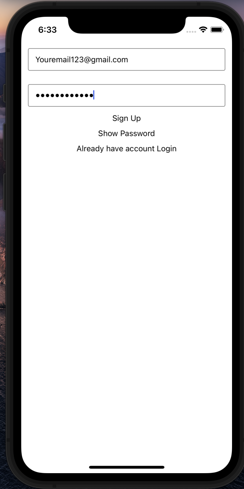

>after sign up


>after sign up it will show your email


>login screen
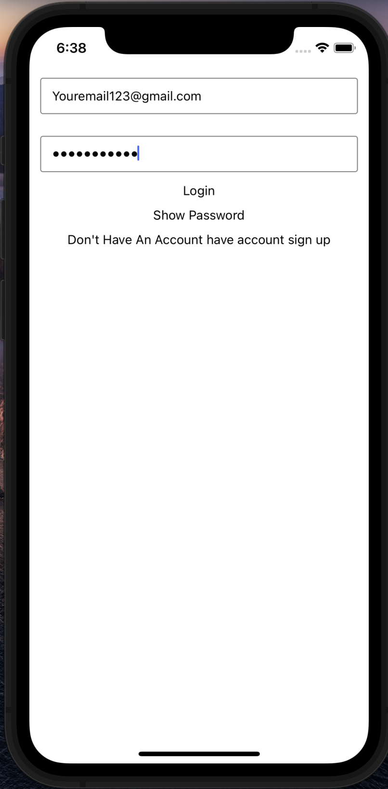

>after login 
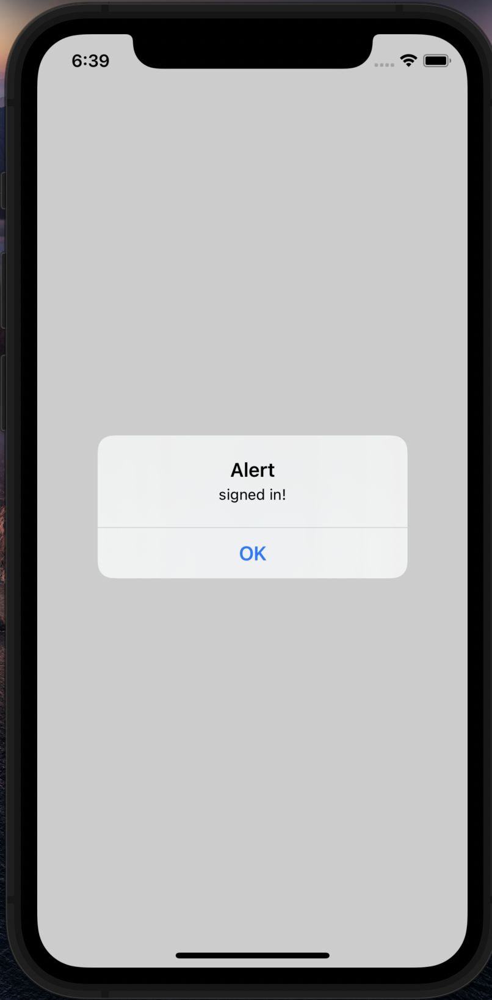

>after login it will show your email
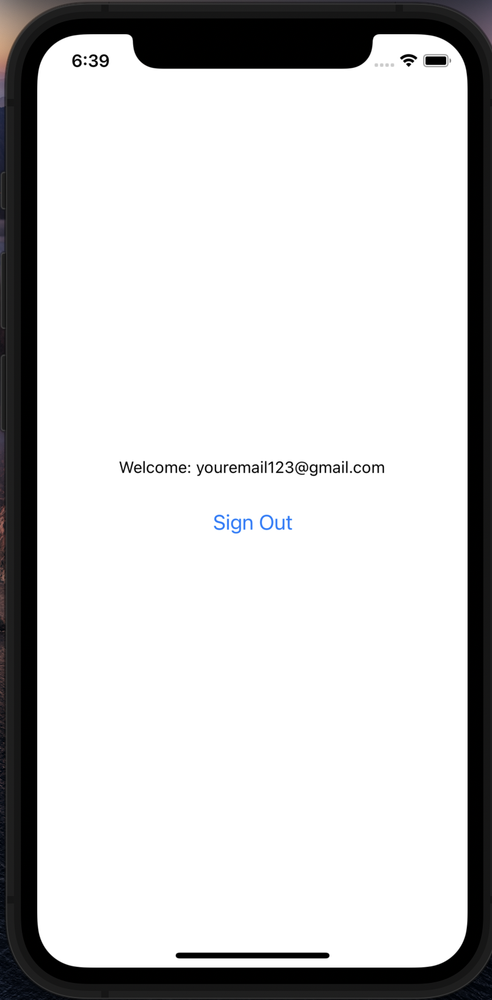

##How to configure app

>go to firebase 
https://console.firebase.google.com/
and click add project
---
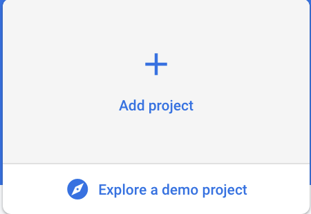
> after clicking you should see somthing like this

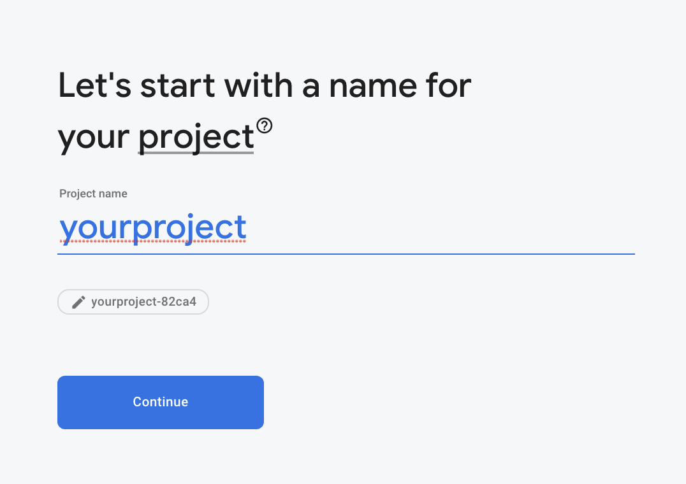

> after clicking disable Google Analytics for this project

>then you should see something like this


>ones its done hit continue

>then select your platform that you wanna build for 


>but before you have to setup authentication
>to do that click on authentication
>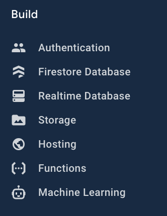
>then go to Sign in method
>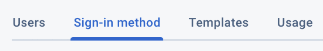
> and then make sure you have seleced email and password to enable by default it will be disable
>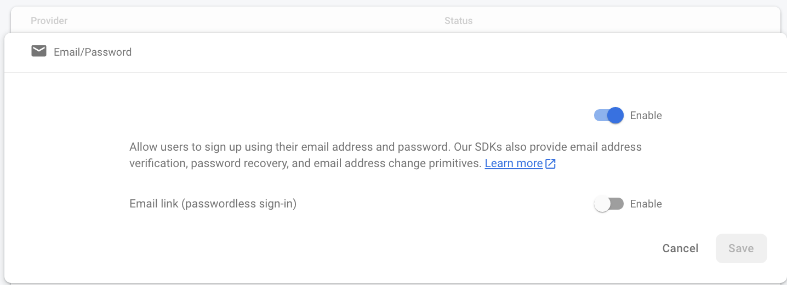

>setup for android 
>>click the android logo
>>
>>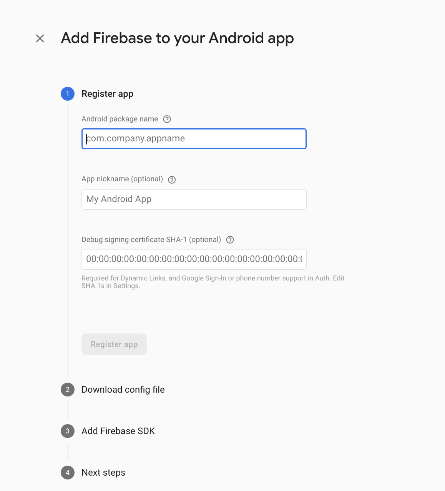
>>for android package name add your package name to do that go to android/app/src/main and open the Androidmanifest.xml
you will see somthing like this or little bit different
the text saying package is your package name
```xml
<manifest xmlns:android="http://schemas.android.com/apk/res/android"
  package="com.yourpackagename">

```
>>after filling your package name in the firebase console
now in the app nick name fill somthing that is closer to your app name 
then you have to enter your sha-1 key
to enter create your keystore for that

>>enter this command on the root of your project
```bash
keytool -genkey -v -keystore android/app/debug.keystore -alias androiddebugkey -keyalg RSA -sigalg SHA1withRSA -keysize 2048 -validity 10000
```
>>then enter the key pass as android
and then just hit enter again and again until it asks for is this information is correct enter yes after it will as for keystorepass hit just enter

>>then run this command
```bash
keytool -list -v -keystore ./android/app/debug.keystore -alias androiddebugkey -storepass android -keypass android
```

>>in the Certificate fingerprints
you should see your sha-1 key
then enter your sha-1 key and hit register app
after that download the config file and then paste your config file in android/app
and then just hit continue and continue


>>
>>now on your root of your project 
if you are using node enter this command
```bash
npm install
```

>>or

```bash
yarn
```

>>then run your project on android
```bash
npx react-native run-android
```
>>then you should have your app running


>setup for ios
>>click on the ios logo
>>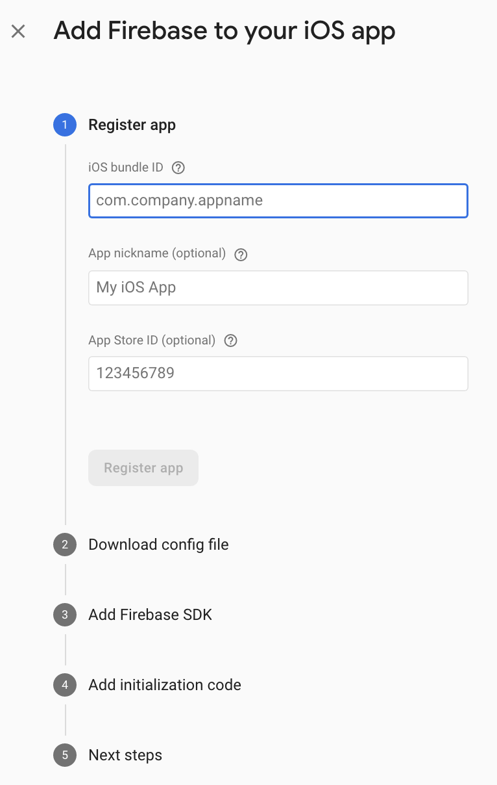
>>enter you bundle id to know whats yours open up xcode and select your project
>>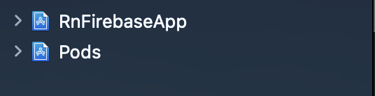
>>click on your app name 
then you should something like this
>>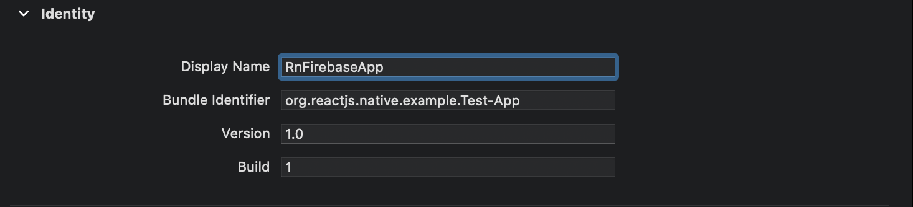
change it to com.yourappname
then on firebase enter your bundleIdentifier
then download the config file do this below here

>> right click on the app name
>>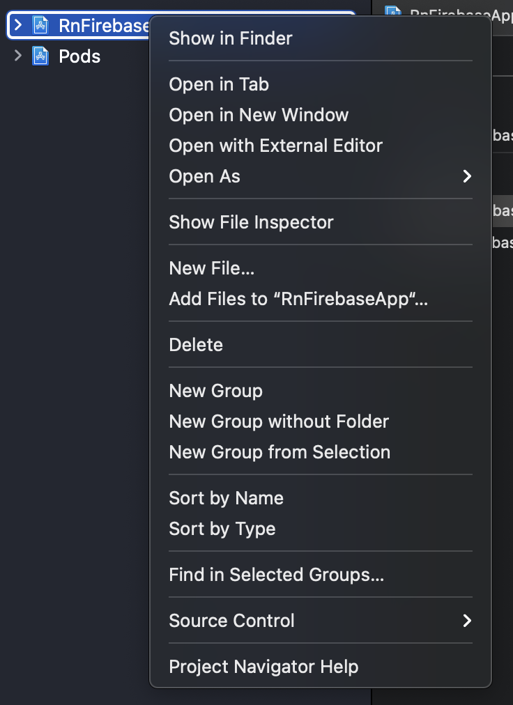
>>then select add files to "RnFirebaseApp"
>>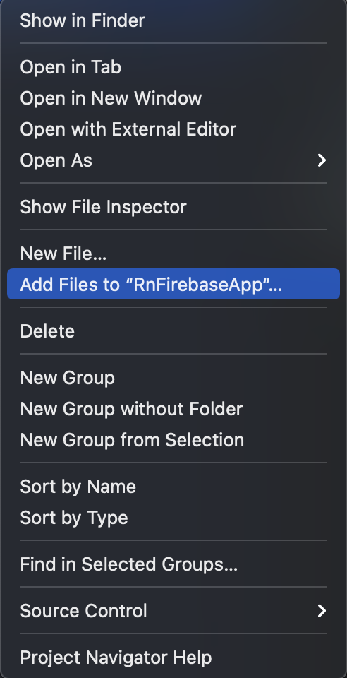
>>after that select the config file you downloaded from firebase
>>select every thing as in the image below then hit add
>>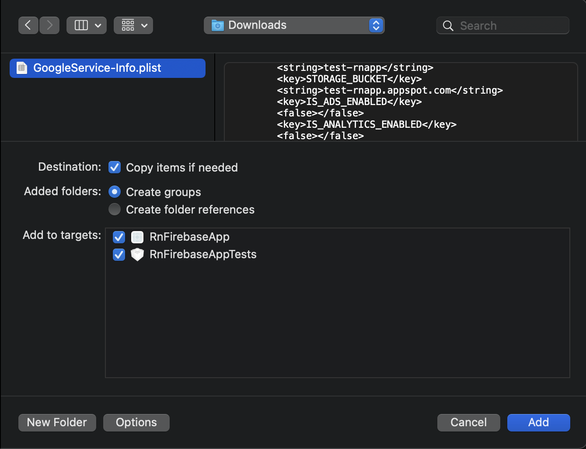
>>after that open your terminal go to your project then enter this command
if you use npm then run this command
```bash
npm install
cd ios/
pod install --repo-update
cd ..
npx react-native run-ios
```
>> for yarn
```bash
yarn
cd ios/
pod install --repo-update
cd ..
npx react-native run-ios
```
>>then you should see as the app running
